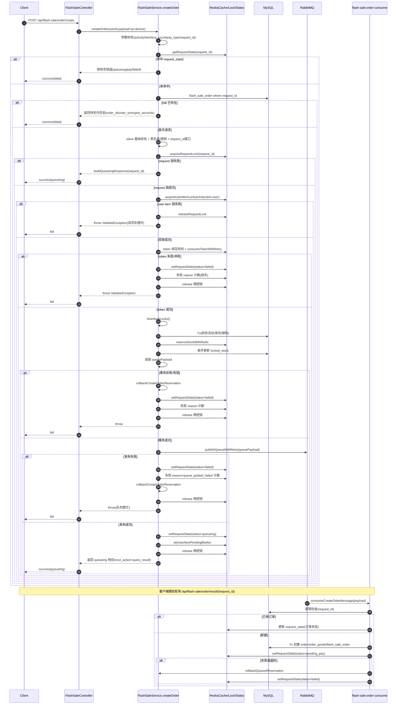
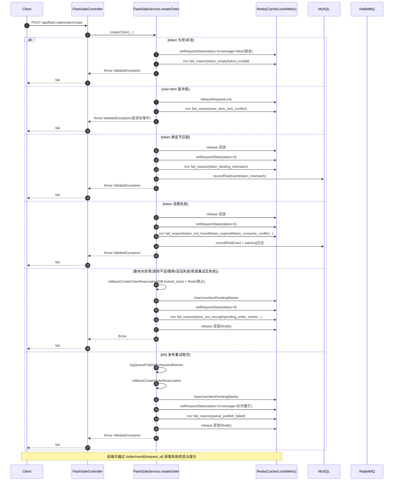

# FlashSale `createOrder` 接口逻辑梳理（完整链路）

本文档基于 `app/djxs_manage/app/api/controller/FlashSale.php` 与 `app/djxs_manage/app/api/service/FlashSaleService.php` 当前实现，整理“创建秒杀订单”从请求进入到异步落单的完整思路。

---

## 1. 控制器入口层（Controller）

入口方法：`FlashSale::createOrder()`

核心动作：

1. 获取登录用户 `userId`（未登录直接返回鉴权响应）。
2. 读取 POST 参数作为 `payload`。
3. 注入两类上下文：
   - `client_ip`：请求来源 IP
   - `device_id`：请求头 `x-device-id/x-device`
4. 调用 `FlashSaleService::createOrder((int)$userId, $payload)`。
5. 成功返回 `success(..., '下单成功')`；异常统一 `failByException()`。

说明：控制器层仅做请求封装和异常出口，业务都在 Service。

---

## 2. Service 同步链路总览（createOrder 主流程）

方法：`FlashSaleService::createOrder(int $userId, array $payload): array`

可分为 11 个阶段：

1. 参数标准化与基础校验
2. request_id 幂等快返（缓存/DB）
3. token 基础合法性校验
4. 风控与限频拦截
5. 双重互斥锁获取（request 维度 + user-item 维度）
6. token 绑定校验与消费
7. 待处理标记冲突校验
8. 事务内库存预占与下单载荷构建（含死锁重试）
9. MQ 发布（含发布重试）
10. 成功态写回（request_state + pending marker + queueing 响应）
11. 异常补偿与锁释放（catch/finally）

---

## 3. 阶段详解

## 3.1 参数标准化与基础校验

从 `payload` 提取并规范化：

- `activity_id` / `item_id`
- `buy_count`（当前硬限制必须是 1）
- `request_id`
- `token`
- `client_ip`（归一化）
- `device_id`（归一化）
- `pay_type`（`wechat|alipay`，并映射 `pay_type_value`）

校验规则：

- `buy_count !== 1` -> `首期仅支持单件购买`
- 活动或商品 ID 非法 -> `参数不完整`
- 支付方式非法 -> `pay_type 不合法`
- `request_id` 非法 -> `request_id 不合法`

---

## 3.2 request_id 幂等快返（非常关键）

### A. 先查 request_state 缓存

- 若缓存存在，校验缓存中的 `user_id` 是否与当前用户一致（防串用）。
- 一致则直接 `buildResponseByRequestState(...)` 返回，避免重复执行热路径。

### B. 再查 `flash_sale_order` 表

- 若 `request_id` 已有订单记录，且 `user_id` 匹配：
  - 联查 `order`
  - 计算 `expire_seconds`
  - 直接返回待支付信息（`order_id/order_sn/pay_amount/next_action=pay`）

这一步保证“同 request_id 多次提交”只会命中一个最终结果。

---

## 3.3 token 前置校验

- `token` 为空 -> 先写失败态 `request_state`，再抛异常
- `token` 格式非法 -> 同样先写失败态，再抛异常

并统一记录失败 reason（新加）：

- `token_empty`
- `token_invalid`

---

## 3.4 创建前风控与限频

执行：

- `assertCreateBlacklist(...)`：黑名单拦截
- `assertCreateRateLimit(...)`：用户/IP/设备限频
- `assertRequestIdWindow(...)`：request_id 生存窗口校验，防重放

命中即直接异常返回，不进入后续锁/库存/MQ环节。

---

## 3.5 双锁模型（并发控制核心）

### 锁 1：`request_id` 维度锁

- `acquireRequestLock($requestId)`
- 获取失败说明已有进程处理同请求，直接返回 `buildQueueingResponse($requestId)`（前端继续轮询 result）。

### 锁 2：用户-商品维度锁

- `acquireUserItemLock($activityId, $itemId, $userId)`
- 获取失败 -> 释放 request 锁并抛 `请求处理中，请勿重复提交`
- 失败 reason：`user_item_lock_conflict`

并定义了两个闭包：

- `markRequestFailed($message)`：统一写失败态 `request_state`
- `releaseCreateLocks()`：统一释放两把锁，避免遗漏

---

## 3.6 token 绑定校验与消费

### A. 绑定关系校验

- `resolveTokenBindingMismatchMessage(...)`
- 不匹配（串参/重放）：
  - 释放锁
  - 写失败态
  - 记录风控 `token_mismatch`
  - 失败 reason：`token_binding_mismatch`

### B. token 消费（带短重试）

- 构建 token key + TTL
- `consumeTokenWithRetry(...)`
- 消费失败：
  - 释放锁
  - `resolveTokenConsumeFailure(...)` 得到可解释原因/文案
  - 写失败态
  - 记录失败 reason（如 `token_not_found` / `token_expired` / `token_consume_conflict`）
  - 记录结构化 warning 与风控日志

---

## 3.7 待处理标记冲突校验

- `hasUserItemPendingMarker($itemId, $userId)` 为 true：
  - 释放锁
  - 抛出“你已有待支付订单”
  - 失败 reason：`pending_marker_conflict`

目的：抑制同用户短时间连续点击导致的重复占用。

---

## 3.8 事务内处理（含死锁重试）

通过 `executeWithDeadlockRetry(...)` 包裹事务体，发生死锁/锁等待超时时会按策略重试，并在每次重试前做清理补偿。

事务内关键步骤：

1. `assertActivityItemValid(...)` 校验活动/商品有效性和时间窗。
2. `hasPurchasedConflict(...)` 已购冲突拦截。
3. 聚合查询用户在该 item 的 `pending_count/paid_count`：
   - 有 pending -> 拒绝
   - paid 超限 -> 拒绝
4. Redis 侧预占库存：`reserveStockWithRedis(...)`
5. DB 条件更新锁定库存：
   - `whereRaw('(total_stock - sold_stock - locked_stock) >= ?', [$buyCount])`
   - `inc('locked_stock', $buyCount)`
6. 构建订单载荷：
   - 商品信息、价格、支付方式
   - `reserve_expire_time`
   - `request_id` 等

重试清理回调与异常分支都统一调用：

- `rollbackCreateOrderReservation(...)`（回滚 DB locked_stock + Redis 预占）

---

## 3.9 MQ 发布阶段

事务结束后先执行一次 `heartbeatLocks()` 续锁，再发布消息：

- `publishQueueWithRetry($queuePayload)`

发布失败：

- 记录 `logQueuePublishExhaustedRetries(...)`
- 抛 `秒杀排队服务繁忙，请稍后重试`
- 在 catch 中统一写失败态 + 回滚
- 失败 reason 映射为：`queue_publish_failed`

---

## 3.10 成功返回（仅表示“进入排队”）

发布成功后调用：

- `buildCreateOrderQueueingResponse(...)`

内部动作：

1. 写 `request_state` 为 queueing（`status=8`）
2. 设置 user-item pending marker（TTL = reserveSeconds + 30）
3. 返回给前端：
   - `request_id`
   - `queueing=1`
   - `next_action=query_result`
   - `status=8`
   - `reserve_expire_time`

注意：此时并非“订单已创建成功”，只是“请求已受理并入队”。

---

## 3.11 异常与 finally

`catch (\Throwable $e)`：

1. 回滚库存预占（DB + Redis）
2. 清理 pending marker
3. 记录统一失败 reason（`resolveCreateOrderFailureReason($e)`）
4. 写失败态 request_state（便于 result 接口返回）
5. 向上抛异常

`finally`：

- 必定执行 `releaseCreateLocks()`，保证两把锁最终释放。

---

## 4. 失败 reason 机制（新增）

createOrder 增加了统一失败 reason 出口：

- 方法：`recordCreateOrderFailureReason(...)`
- 输出：
  1) warning 日志：`flash-sale create-order failed`
  2) Redis 计数器：`flash:sale:create:fail:reason:{yyyymmdd}:{reason}`

常见 reason 包括（示例）：

- `token_empty`
- `token_invalid`
- `token_binding_mismatch`
- `token_not_found` / `token_expired` / `token_consume_conflict`
- `pending_marker_conflict`
- `queue_publish_failed`
- `stock_not_enough`
- `pending_order_exists`
- `lock_refresh_failed`
- `create_order_exception`

价值：压测或线上故障时，可直接按 reason 聚合定位热点失败类型。

---

## 5. 异步消费链路（与 createOrder 对应）

`createOrder` 只负责“排队受理”，真正建单在：

- `consumeCreateOrderMessage(array $payload)`

主要动作：

1. request_id 幂等检查（已存在则直接刷新 request_state 返回）
2. 过期检查（超时则回滚预占并写失败态）
3. 事务内创建 `order + order_goods + flash_sale_order`
4. 回写 request_state 为“订单已创建，请尽快支付”
5. 失败时回滚预占并写失败态

这与前端的 `order/result/{request_id}` 轮询配合，形成最终闭环。

---

## 6. 状态机视角（简化）

`request_state.status` 常见值：

- `8`：queueing（已受理，排队中）
- `0`：pending pay（订单已创建待支付）
- `1`：paid
- `2`：canceled
- `3`：failed（各种失败原因）

前端应以 `request_id` 轮询 result 接口，直到进入终态。

---

## 7. 一句话总结

`createOrder` 本质是“高并发受理入口”而非最终建单接口：通过 **幂等 + 风控限频 + 双锁 + token 一次性消费 + Redis/DB 双层库存预占 + MQ 异步建单 + 状态缓存回传**，在保障不超卖和抗并发冲突的前提下，把重流程转移到异步消费者完成。

---

## 8. 时序图（Mermaid 版）

---

## 9. 失败路径时序图（Mermaid 版）

